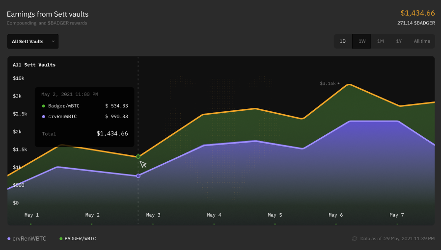

# Badger Portfolio 

The Badger Portfolio is a dashboard allowing to track LP tokens polled inside Badger Finance. This was submitted during a month long Badger Hackathon.

### Tech stack
-	Figma Design: [Portfolio](https://www.figma.com/community/file/1134113376517281703)
-	Material UI: [Material-UI](https://material-ui.com/getting-started/installation/)
-	MobX: [MobX](https://mobx.js.org/README.html)

Any further questions can be asked on Discord: 0xDaVinciCode#1662
